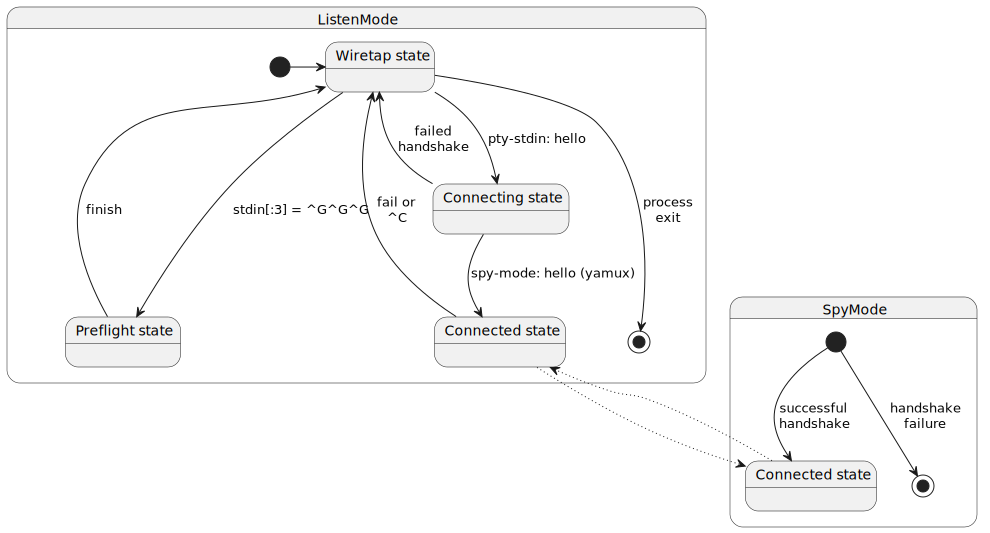

# Unbound-SSH

An SSH server is capable of exposing a lot of subservices such as port-forwarding, file transfer, remote command
execution, interactive shell, etc. however for security reasons, you may find yourself in a situation where all these
services are disabled except interactive shell by the system administrator.

Unbound-ssh tool can come to your assist in such a situation and transform the interactive shell you have into a tunnel.
On your laptop you will have unbound-ssh server running in listen-mode that is wrapping the interactive shell and on the
server side you
have unbound-ssh running in spy-mode, and they communicate through interactive shell stream of bytes.

## Codec

These two unbound-ssh instances can not simply send their bytes to each other raw because of terminal buffering, or
ascii control characters that may be consumed by the shell provider.
To resolve this limitation, unbound-ssh sets tty to raw mode, plus it uses a codec to encode and decode the byte stream.
Currently "hex" codec where each byte is encoded as two ascii characters is implemented which is very simple, robust but
not very efficient.

## Multiplexer

Interactive shell is just a stream of bytes, therefore it represents a single connection at best. In order to serve all
connections that bind to unbound service port we need to use a multiplexer on the single connection that we have. In
unbound-ssh I used [yamux](https://github.com/hashicorp/yamux). we create a yamux session and then create as many yamux
streams under it to serve multiple connections.

To support multiple services, unbound-ssh reserves the first yamux stream and call it "control" stream. This stream is
used to communicates such as listen-mode / spy-mode initial handshake, asking spy-mode which service to serve on the
next incoming stream, etc.

## Preflight

Since unbound-ssh is required on both sides of the tunnel and server may or may not have internet access, also for
convenience I have added a preflight mode to unbound-ssh.

After launching unbound-ssh in listen-mode and connecting to the shell of the server, you can press <ctrl+g> three times
to launch preflight script.

In preflight script, unbound-ssh will run a set of commands on the shell to examine whether it has internet connection,
or which unix tools are installed on it. Then it will either directly download the unbound-ssh binary appropriate for
the server operating system and architecture using cURL or wGet if it has internet connection, otherwise it downloads
the binary to your laptop and uploads it chunk-by-chunk to the server using `dd`. the chunks are gzipped and encoded
either in base64 or ascii85 depending on the availability of `base64` or `python3` on server.

Spy-mode also needs an identical config.toml file to listen-mode, so unbound-ssh will also upload the config.toml file
to the server using the same mechanism. If there are other dependencies, they will be taken care of as well.

## State Transitions



## Core Structs and Interfaces

Explaining the rationale behind certain code parts may help you to understand the codebase better.

### Wiretap State

- `ContextReader`: perhaps the most important class in the whole project. Since an `io.Reader` is not interruptible or
  cancellable I came up with this tool that provides `func Read(ctx context.Context, buf []byte)` interface for reading
  instead, obviously if `ctx` is cancelled any existing go routing that is blocked on `Read()` will be released with an
  error that is `context.Cause(ctx)`. The way this struct works is that it acts as a wrapper around an `io.Reader` and
  it will spawn a go routine to read from the underlying reader. the go routine will store the resulting data or error
  in a buffer to be returned to the next caller. This also made it easy to implement an `Unread(buf []byte)` method that
  will return a buffer back to the reader.
- `ContextBoundReader`: since the latter struct is not compliant with `io.Reader` interface, this struct holds an
  instance of a context and a pointer to `ContextReader` to be able to provide a `func Read(buf []byte)` method.
- `ContextBindingReader`: a simple interface `func BindTo(ctx context.Context) io.ReadCloser` for clean
  code. `ContextReader` implements such interface and produce a `ContextBoundReader`.
- `Signature`: a simple interface `Find(in string) (matchEndIndex int)`, any struct that implements this interface can
  be used to detect a regex signature in an input. `matchEndIndex` will be -1 if no match is found, otherwise it will be
  the index of the first character right after the match. After a match the struct often extracts some data from the
  match and stores it in its fields.
- `SignatureDetectorContextBoundReader`: a `ContextBoundReader` that as soon as it detects a regex signature in the
  stream it cancels the context with `SignatureFound` error. This is used in the wiretap state to detect a hello message
  from the spy-mode and run the state transition.

### Preflight

- `CaptureResult`: it is a `Signature` that can be used to send back the result of a preflight executed command. The preflight command need to wrap its output in the following signature so that the listen-mode can capture and parse it. There is a `GenerateCommandAndCaptureResult` convenient function that generates both a `printf` shell command that does this for you and a `CaptureResult` struct instance that reads its result.
```
________capture_begin_<command_uuid>________
<data>
________capture_end_<command_uuid>________
```
- `BatchCommandResult`: it's a special form of the latter that can be used to send back the result of a batch of commands.